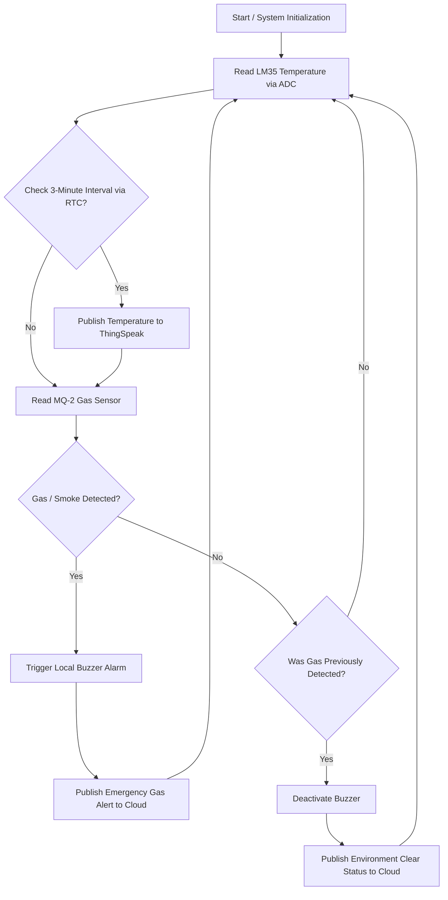

# EDGE-TO-CLOUD-HEAT-MONITORING-FOR-INDUSTRIAL-ENVIRONMENTS

## 🎯 Abstract

In modern industrial environments, maintaining precise temperature thresholds is critical for ensuring machinery safety, operational reliability, and process efficiency.

**Edge-to-Cloud Heat Monitoring** is a smart and scalable IoT-based solution that combines real-time edge temperature sensing with cloud-based telemetry and data logging. The system processes critical thermal events locally at the edge, while transmitting relevant data to the cloud for centralized monitoring and analysis.

By detecting abnormal conditions at the edge and providing cloud-based visibility, the system helps reduce response latency, improve operational safety, and support predictive maintenance.

---

## ✨ Key Features

* **Real-Time Edge Monitoring:** Continuously monitors temperature and environmental conditions at the equipment level.
* **Automated Alerts:** Provides immediate local alerts when temperature or gas/smoke levels exceed defined thresholds.
* **Cloud Telemetry:** Transmits sensor data and emergency alerts to the cloud using an ESP8266 Wi-Fi module.
* **Historical Data Logging:** Stores monitoring data on the ThingSpeak IoT platform for visualization and analysis.
* **Predictive Maintenance Support:** Logged sensor trends can be analyzed to identify abnormal patterns and potential equipment failures.
* **Modular Embedded Design:** Uses separate drivers for ADC, LCD, UART, RTC, and ESP8266 communication.

---

## 📐 System Block Diagram


---

## 🛠️ Hardware Requirements

| Component             | Description / Function                                       |
| :-------------------- | :----------------------------------------------------------- |
| **LPC2148**           | ARM7TDMI-S microcontroller used as the main control unit     |
| **LM35**              | Analog temperature sensor for temperature measurement        |
| **MQ-2**              | Gas and smoke detection sensor                               |
| **ESP8266 (ESP-01)**  | Wi-Fi module used for cloud communication                    |
| **16x2 LCD**          | Displays temperature and system status locally               |
| **Buzzer**            | Provides a local audio alarm during emergency conditions     |
| **USB-to-UART / DB9** | Serial communication interface for programming and debugging |

---

## 💻 Software Requirements & Tools

* **IDE / Compiler:** Keil µVision
* **Programming Language:** Embedded C
* **Microcontroller:** LPC2148 ARM7TDMI-S
* **Flashing Tool:** Flash Magic
* **Cloud Platform:** ThingSpeak IoT Platform
* **Communication:** UART / Wi-Fi

---

## ⚙️ Project Implementation & Workflow

### 1. Modular Testing Phase

Before integrating the complete system, individual peripheral modules were developed and tested separately.

#### Display System

**Files:** `lcd.c`, `lcd.h`

* Tested LCD initialization.
* Verified character and string display.
* Tested integer value display.
* Verified system status messages.

#### Temperature Acquisition

**Files:** `ADC.c`, `adc_defines.h`

* Interfaced the LM35 temperature sensor with the LPC2148 ADC.
* Read the analog sensor output through the microcontroller's built-in ADC.
* Converted the ADC value into a corresponding temperature value.
* Verified temperature readings before system integration.

#### Gas / Smoke Detection

**MQ-2 Sensor**

* Tested the MQ-2 sensor for gas/smoke detection.
* Implemented threshold-based detection.
* Used GPIO/LED indication during testing.
* Verified alarm triggering when the threshold was exceeded.

#### Serial Communication

**Files:** `uart0.c`, `uart0.h`, `esp01.c`, `esp01.h`

* Tested UART communication between the LPC2148 and ESP-01.
* Configured the ESP8266 using AT commands.
* Verified serial data transmission and reception.
* Tested communication using a terminal interface.

---

### 2. System Integration & Driver Development

After individual peripheral testing, the modules were integrated into a single embedded system.

* Connected the LM35 temperature sensor to the LPC2148 ADC.
* Connected the MQ-2 sensor for gas/smoke detection.
* Connected the ESP-01 module to the LPC2148 UART interface.
* Developed custom ESP-01 communication drivers.
* Integrated LCD, ADC, UART, RTC, and sensor drivers.
* Implemented cloud communication with ThingSpeak.
* Tested static payload transmission to a ThingSpeak channel.

---

## 🔄 Operational Logic



---

## 🧠 System Working

The system starts by initializing the LPC2148 microcontroller and its connected peripherals.

1. The **LM35** continuously provides an analog temperature signal.
2. The LPC2148's **ADC** converts the analog signal into a digital value.
3. The temperature value is processed by the embedded application.
4. The **RTC** is used to determine the configured cloud publishing interval.
5. At the defined interval, temperature data is transmitted to **ThingSpeak** through the **ESP8266**.
6. The **MQ-2** continuously monitors the environment for gas or smoke.
7. When gas/smoke is detected:

   * The local **buzzer** is activated.
   * An emergency status is transmitted to the cloud.
8. When the environment becomes clear:

   * The buzzer is deactivated.
   * An environment-clear status can be published to the cloud.
9. The monitoring cycle then repeats continuously.

---

## ☁️ Cloud Monitoring

The **ESP8266 (ESP-01)** provides Wi-Fi connectivity between the embedded system and the ThingSpeak IoT platform.

The system can transmit:

* Temperature data
* Gas/smoke emergency status
* Environment-clear status
* Time-based telemetry data

ThingSpeak can then be used to visualize sensor readings and analyze historical trends.

---

## 📂 Project Structure

```text
EDGE-TO-CLOUD-HEAT-MONITORING-FOR-INDUSTRIAL-ENVIRONMENTS/
│
├── Header_files/
│   ├── adc_defines.h
│   ├── defines.h
│   ├── delay.h
│   ├── esp01.h
│   ├── lcd.h
│   ├── lpc214x.h
│   ├── lpc21xx.h
│   ├── rtc.h
│   ├── rtc_defines.h
│   ├── types.h
│   └── uart0.h
│
├── Source_files/
│   ├── ADC.c
│   ├── delay.c
│   ├── esp01.c
│   ├── lcd.c
│   ├── projectmain.c
│   ├── rtc.c
│   └── uart0.c
│
└── README.md
```

---

## 📸 Project Video


---

## 🎥 Project Demonstration

Project demonstration video:

```text
https://github.com/user-attachments/assets/12345678-abcd-1234-abcd-123456789abc
```

---

## 🚀 Future Enhancements

* Add a web-based real-time monitoring dashboard.
* Implement configurable temperature and gas thresholds.
* Add SMS/email notifications for critical events.
* Store long-term sensor data for advanced analytics.
* Implement machine-learning-based predictive maintenance.
* Add additional industrial sensors for vibration, pressure, and humidity monitoring.
* Implement secure MQTT-based communication.

---

## 👩‍💻 Technologies Used

**Embedded C | ARM7 | LPC2148 | ADC | UART | RTC | LCD | LM35 | MQ-2 | ESP8266 | Wi-Fi | ThingSpeak | Keil µVision | Flash Magic**

---

## 📌 Project Summary

**Edge-to-Cloud Heat Monitoring for Industrial Environments** demonstrates the integration of embedded systems, environmental sensing, wireless communication, and cloud-based IoT monitoring.

The project combines **edge-level decision making** with **cloud telemetry**, providing a foundation for industrial condition monitoring, emergency alerting, and predictive maintenance applications.
